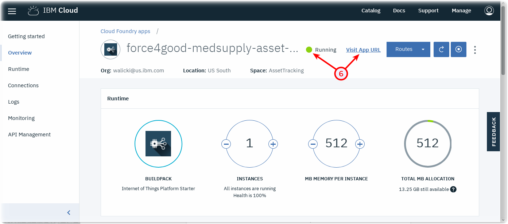
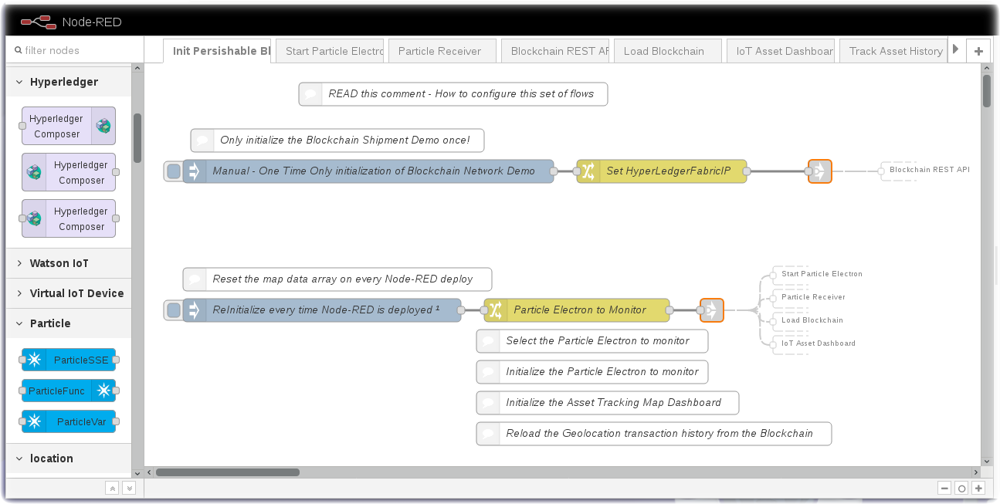
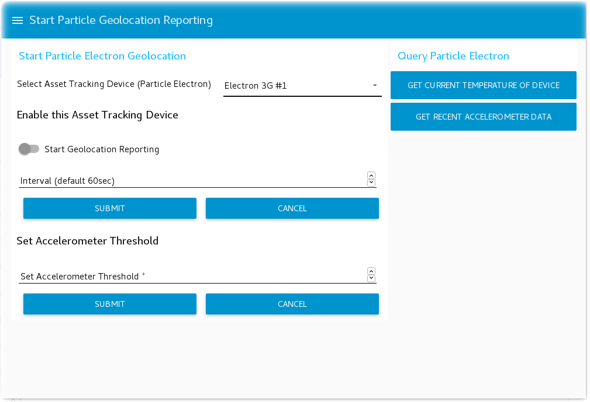
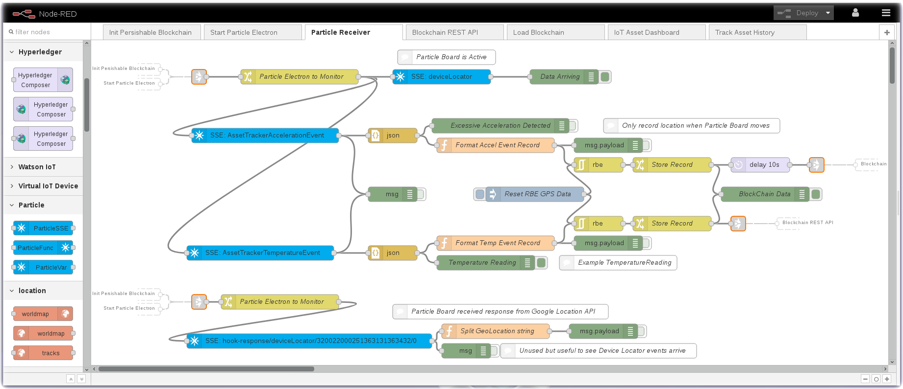
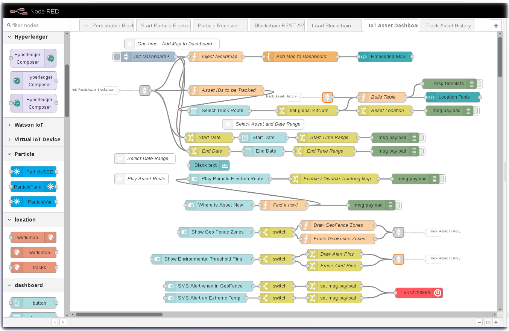

# Node-RED - IoT Asset Tracker
## Node-RED - IoT Asset Tracker Introduction

These Node-RED program flows implement an IoT Asset Tracker that receives geolocation and environmental sensor data from a Particle Electron, stores that information in a Hyperledger Fabric blockchain and visualizes the routes of the IoT devices on a map / dashboard. It triggers alerts when environmental thresholds are exceeded.

During this workshop you will copy the flow from github and deploy it into your to Watson IoT / Node-RED Starter application running on IBM Cloud.

These seven flows perform the following functions:

* **Initialize Blockchain and Node-RED variables** - Set some globals that drive all of the flows.
* **Control a Particle Electron** - A Node-RED Dashboard which enables / disables / configures a Particle Electron.
* **Receive Particle Electron events** - subscribe to Particle Electron event handlers.
* **Write Particle Electron data** to a Hyperledger Fabric Blockchain.
* **Load Blockchain Transaction History** so the IoT device routes can be plotted
* **Build a Dashboard** that controls the visualization of devices.
* **Move a IoT asset along its recorded history** by visualizing the route on a map.

The dashboards are not intended to be a fancy user experience for end users.  These dashboards are demonstrations for a developer of what an IoT Asset Tracker might be capable of.  End users are not likely to be interested in geolocation coordinates.

## Getting started with Node-RED in the IBM Cloud
Before you can deploy the IoT Asset Tracker dashboard, you need to create an IoT Starter application in the IBM Cloud.  This section walks you through those steps.
### Create an Internet of Things Starter App
* Create an account and log into [IBM Cloud](http://bluemix.net)
* Click on the Catalog **(1)** and search for 'internet of things' **(2)**
* The Internet of Things Platform Starter **(3)** boilerplate is a pattern with pre-assembled services that work together.  The Internet of Things Platform Starter includes a Node-RED Node.js web server, Cloudant database to store the flow, and the IoT platform service so you can connect devices.

* Name your application something unique. If you choose myapp, your application will be located at http://myapp.mybluemix.net   There can only be one “myapp” application and URL registered in IBM Cloud.
* Give the application a unique name **(4)** - eg. IoTAssetTracker-yourname
* Press the Create button **(5)**.

* IBM Cloud will create an application in your account based on the services in the boilerplate. This is called staging an application. It can take a few minutes for this process to complete.  While you wait, you can click on the Logs tab and see activity logs from the platform and Node.js runtime.

### Launch the IoT Starter Application
Once the Green “Running” icon appears, Click the  Visit App URL link **(6)**

### Open the Node-RED visual programming editor
A new browser tab will open to the Node-RED start page.  Node-RED is an open-source Node.js application that provides a visual programming editor that makes it easy to wire together flows. Select a username / password to access the Node-RED editor. Remember your username / password. Click the red button. Go to your Node-RED flow editor to launch the editor.
* The Node-RED Visual Programming Editor will open with a default flow.
* On the left side is a palette of nodes that you can drag onto the flow.
* You can wire nodes together to create a program.
* The sample IoT Starter flow is not applicable to this workshop and can be deleted.
* We will import the flows discussed above.

### Install Additional Node-RED nodes
The IoT Starter Application deployed into IBM Cloud includes just a small subset of Node-RED nodes. The Node-RED palette can be extended with over one thousand additional nodes for different devices and functionality.  These NPM nodes can be browsed at http://flows.nodered.org

In this Step, you will add the Node-RED Dashboard nodes to your Internet of Things Starter Application.
* Click on the Node-RED Menu **(1)** in the upper right corner, then Manage palette **(2)**

* Turn to the Install tab **(3)**, type node-red-dashboard **(4)** and press the Install button **(5)**.

* Press the Install button in the next dialog.
* Repeat **(4)** to install **node-red-contrib-particle** and **node-red-contrib-web-worldmap** nodes.

### Import a prebuilt flow from GitHub
Since configuring Node-RED nodes and wiring them together requires many steps to document in screenshots, there is an easier way to build a flow by importing a prebuilt flow into your IoT Starter Application.

* Some of the sections below will have a **Get the Code** link.

* When instructed, open the **Get the Code** github URL, mark or Ctrl-A to select all of the text, and copy the text for the flow to your Clipboard.
* Click on the Node-RED Menu **(6)**, then Import **(7)**, then Clipboard **(8)**.

* Paste the text of the flow into the **Import nodes** dialog and press the red **Import** button.

* The new flow will be imported into **new tabs** in the Node-RED Editor.

## Initialize the Perishable Blockchain / Node-RED flow
### Introduction
This flow sets several global variables that drive all of the other flows. Instead of hunting through the other flows to modify the Hyperledger Fabric IP address or your Particle Electron Device ID and access token, this flow simply pulls the globals forward and initializes the remaining flows.

* If you have set up your [Hyperledger Fabric](../Blockchain/README.md), edit the **Set HyperLedgerFabricIP** change node and insert the public IP address.
* If you purchased your own Particle Electron, you will need to know the Particle Device ID and Access Token and insert those details into the **Particle Electron to Monitor** change node.
* If you are participating in a workshop, the instructor will share the Particle Device ID and Access Token in a separate slide (not part of GitHub)

The Initialization flow then uses Link nodes to most all of the other flows described below to drive the demo and workshop.

As a first step, copy the code from GitHub to your Clipboard and import it into your Node-RED editor.

Get the Code [IoT Asset Tracker Node-RED flows](flows/IoTAssetTracker-AllFlows.json)

## Control Particle Electron events
### Introduction
This flow controls the Particle Electron device configuration.  This flow can send a command to enable / disable the device geolocation reporting.  It can change the interval of the report.  The default is 60 seconds.  It also exercises the two query Particle Functions - GetRecentXYZ() and GetCurrTemp().  The acceleration threshold can also be remotely configured through a call to SetXYZThresh().

The Particle.io URL function calls use a AccessToken to control a particular device. The AccessToken is set in the InitPerishableBlockchain flow (on the first tab) The instructor will reset this access token after the workshop.

The inspiration for this dashboard came from Hovig Ohannessian. He wrote a [Particle Core Bluemix article](https://www.ibm.com/blogs/bluemix/2015/05/led-hello-world-with-spark-core-android-bluemix/)
that sets up the params and uses a **http request node** to post the Particle function command.

I also experimented with the Node-RED Particle Function nodes but I found them inflexible in this use case. The flow could not dynamically set the Particle Device ID or AccessToken.  When there are multiple Particle devices selectable from the drop down, the Node-RED Particle Function nodes are hard coded to specific devices. While you might only have one Particle Electron for prototyping an IoT Asset Tracker, when you start a deployment, you might have dozens / hundreds.  I would recommend switching to MQTT for production deployments.

## Receive Particle Electron events
## Introduction
The Particle Receiver flow uses the **node-red-contrib-particle** nodes. The ParticleSSE node lets you subscribe to incoming server-sent events (SSE) on a Particle cloud via a persistent connection.

There are four ParticleSSE() nodes on this flow. Each needs to be configured with a Device ID and an AccessToken - set by the InitPerishableBlockchain flow.
* The first ParticleSSE() node just confirms that there is a Google Maps geolocation Event enabled and subscribes to the deviceLocator event on a particular Electron. The flow doesn't do anything with this information. It's just a sanity check.
* The bottom ParticleSSE() node experiments with parsing the geolocation event message. The flow doesn't do anything with this information.
* The middle ParticleSSE() nodes subscribe to the AssetTrackerAccelerationEvent and AssetTrackerTemperatureEvent functions of our Particle Electron - review the [WatsonIoTAssetTracker program here](../ParticleElectron/README.md). This information is converted from a string to a JSON object, parsed and reformatted into a msg.payload that is expected for a Blockchain event.  If the device GPS coordinates have not moved, discard the event by using a Report By Exception node. This decision was simply because I only care about the environmental sensor conditions of the device in motion (and it was filling my blockchain while sitting on my desk).  A real implementation might care about temperature and acceleration events while the device sits in a distribution center parking lot or port.  Often the AssetTrackerAccelerationEvent and AssetTrackerTemperatureEvent functions are triggered nearly simultaneously by the deviceLocator callback.  The flow staggers the blockchain writes a little to avoid overwhelming the Hyperledger Fabric (which could cause a write failure).

In summary, this flow takes the arriving data, reformats it and calls the next flow to write the Particle Events to the Hyperledger Perishable Network blockchain transaction history.

## Write Particle Events to Hyperledger Perishable Network Blockchain
### Introduction
This flow sets up the http parameters to call the Hyperledger Perishable Network REST APIs.  Learn about the Hyperledger Perishable Network model in the [Blockchain README](../Blockchain/README.md) section of this workshop / IBM Code pattern. There are six REST API examples in this flow.
* The first REST API calls the SetupDemo API.  This only needs to be called once. Buried deep in the Blockchain Model [chaincode logic.js](../Blockchain/IoT-Perishable-Network/logic.js), there is a setupDemo() function where you will need to insert your Particle Device ID as the Shipment ID
* The second section sets up the POST command required to write a Temperature event into the blockchain as a transaction.
* The third section sets up the GET command required to query all of the Temperature transactions on the blockchain.
* The fourth section sets up the POST command required to write an Acceleration event into the blockchain as a transaction.
* The fifth section sets up the GET command required to query all of the Acceleration transactions on the blockchain.
* The sixth section sets up the POST command required to write a geolocation event into the blockchain as a transaction. The flow does not use this transaction history because the Temperature and Acceleration events have geolocation coordinates associated with them.

## Load Perishable Network Blockchain Transaction History
### Introduction
The Load Perishable Network Blockchain Transaction History flow starts to become specific to the Asset Tracker dashboard implementation of this program and workshop.  It queries the Temperature blockchain transaction history and then merges the Acceleration blockchain transaction history into an **array** that will drive the map.

## Build an Asset Tracking Dashboard
### Introduction
This flow constructs a variety of Node-RED Dashboard UI elements to select and control the movement of the routes that the device shipment (via trucks, cars, ships) took while collecting IoT environmental sensor readings.  A Particle Electron asset tracking device might take trips on different days so there is a date picker to narrow the map paths. There is a bunch of flow logic to display pins and geo fences on the map.

## Move the Tracked Device on a Map
### Introduction
This final flow drives the movement of a selected Particle Electron IoT AssetTracker device during its journey. Every fraction of a second, it advances the device on a map.  It filters the array down to the selected device and time frame.  There might be better ways to manage these arrays.  After a few dozen routes, it probably doesn't scale.  It makes for a great demo and workshop. There's always room for enterprise scale improvements.  Enjoy!

## Congratulations! You have completed the Workshop / IBM Code Pattern
You've built an IoT Asset Tracker with environmental sensors that store data in a Hyperledger Blockchain.

